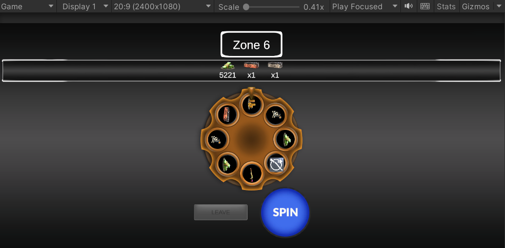
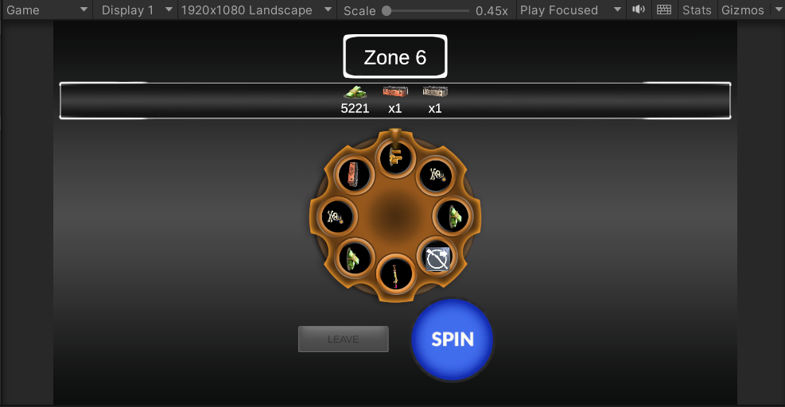
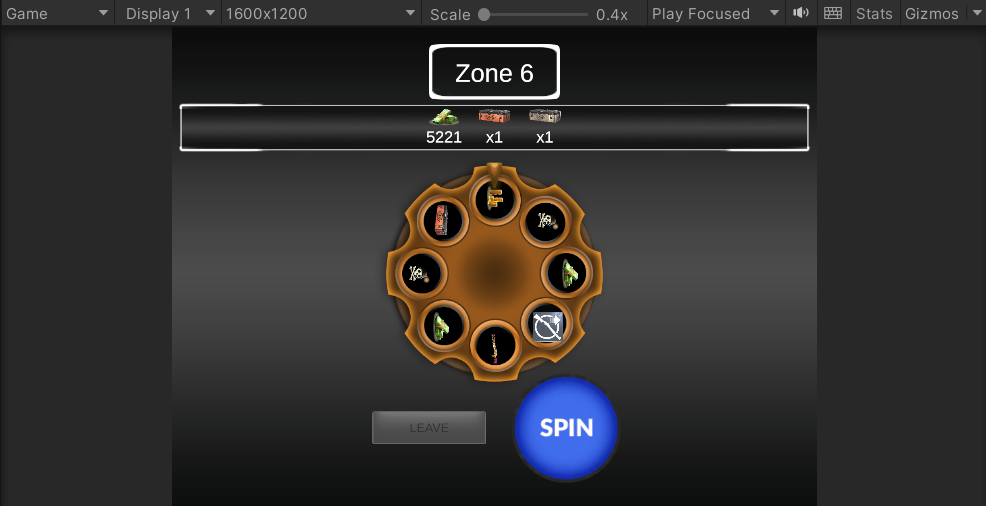

# Vertigo Wheel Demo

A Wheel of Fortune–style mobile game demo built as a case study for **Vertigo Games**, targeting **Android** on **Unity 2021.3 LTS** (Built-in Render Pipeline).

The player spins a reward wheel across escalating zones, collects cash, gold, and special items, and decides when to cash out on Safe or Super zones — or risk a bomb on Normal zones. Wheel contents (rewards, bombs, and slice weights) are driven by **ScriptableObject** configs so designers can rebalance the game from the Inspector without changing code.

**Repository:** https://github.com/doguoruc854/VertigoWheelDemo

---

## Screenshots

UI verified on three aspect ratios (Game view fixed resolutions):

### 20:9 (2400 x 1080)



### 16:9 (1920 x 1080)



### 4:3 (1600 x 1200)



---

## Features

### Zones
- **Normal** — default zones; bomb slices are possible.
- **Safe** — every 5th zone (5, 10, 15, …); no bombs; **Leave** unlocked.
- **Super** — every 30th zone (30, 60, …); no bombs; **Leave** unlocked; premium wheel layout.

Zone type selects a dedicated `WheelConfigSO` (`Normal` / `Safe` / `Super`), so rules and reward tables stay data-driven.

### Reward progression by zone
Currency rewards (cash, gold) use a min/max range on each `RewardDataSO`. As the zone index rises, the **floor of the roll increases** toward the configured maximum, so later zones pay out more on average. The **upper cap stays fixed** (`maxValue` never increases), so early-game and late-game stay within the same designer-defined ceiling.

### Rarity by zone type
Slice selection is **weighted**. Normal wheels bias toward common currency and include bombs. Safe and Super wheels remove bombs and raise the relative weight of **chests, weapon skins, upgrades, and other special items**, so rare drops are more likely when the player reaches those checkpoints.

### Bomb and revive
On a bomb (Normal only), collected rewards are kept until the player chooses:
- **Give Up** — clear inventory and restart from Zone 1, or
- **Revive** — spend **25 gold** and continue on the same zone.

### Leave / cash out
**Leave** is available only while Idle and only on Safe or Super zones. Cash-out shows a success screen with the collected inventory, then a clean restart from Zone 1.

### Inventory
Stackable inventory for currencies and item counts, shown under the zone HUD. Special items stack by count; currencies stack by id.

### Presentation
- DOTween spin and UI motion
- Sprite Atlas for UI sprites
- Zone-matched wheel chrome (bronze / silver / gold)
- Canvas Scaler: Scale With Screen Size + **Expand** (reference 1080 x 1920)
- UI naming: `ui_[element]_[context]_[detail]`; dynamic fields end with `_value`

---

## Architecture

Logic is kept as plain C# where possible; MonoBehaviours handle Unity lifecycle, visuals, and input.

| Component | Responsibility |
|---|---|
| `ZoneManager` | Zone index; Normal / Safe / Super rules |
| `GameStateMachine` | Idle → Spinning → Result → Idle / GameOver / Ended |
| `WheelResolver` | Weighted random slice pick |
| `RewardManager` | Inventory add / clear / spend gold |
| `IRewardEffect` | Strategy for Currency / SpecialItem / Multiplier |
| `RewardDataSO` | Reward definition, icons, amount range, zone scaling |
| `WheelConfigSO` | Slice list (reward ref, bomb flag, weight) per zone type |
| `WheelController` | Slot visuals, DOTween spin, zone look |
| `GameManager` | Orchestration only (no gameplay rules embedded in UI) |

**Data assets**
- Wheel configs: `Assets/ScriptableObjects/WheelConfigs/`
- Reward definitions: `Assets/ScriptableObjects/RewardDefinitions/`

**Design notes**
- SRP: zone math, resolution, rewards, and spin animation are separate.
- OCP: new reward behaviour via `IRewardEffect` without rewriting `RewardManager`.
- Editor OnClick is not used for core buttons; listeners are wired in code.
- Decorative Images keep Raycast Target off; interactive controls keep it on.

---

## Requirements

- Unity **2021.3 LTS**
- Android Build Support (SDK, NDK, OpenJDK) for device builds
- DOTween (included under `Assets/Plugins/Demigiant`)

---

## How to run (Editor)

1. Open the project in Unity Hub.
2. Open `Assets/Scenes/SampleScene.unity`.
3. Press Play.
4. **Spin** (or Space) to spin.
5. Reach a **Safe** or **Super** zone to enable **Leave**.
6. On a bomb, use **Give Up** or **Revive** (25 gold).

---

## Tests

Window → General → Test Runner → **EditMode** → Run All.

Coverage includes:
- Safe / Super zone detection
- State machine transitions (including Ended for leave success)
- Reward stacking and gold spend
- Weighted resolver behaviour
- Production Safe / Super configs contain **no bomb** slices
- Currency amount scaling by zone (min rises, max fixed)

---

## Android build

1. File → Build Settings → Platform **Android** → Switch Platform.
2. Player Settings → set a unique Package Name (for example `com.doguoruc.vertigowheeldemo`).
3. Build → output path such as `Builds/VertigoWheelDemo.apk`.
4. Install on a device or emulator and smoke-test spin, leave, and bomb revive.

---

## Project layout (high level)

```
Assets/
  Scripts/
    Core/          GameManager, state machine
    Gameplay/      Zone, wheel, rewards, resolver
    Data/          ScriptableObject definitions
    UI/            HUD, inventory, bomb revive, leave success
  ScriptableObjects/
    WheelConfigs/
    RewardDefinitions/
  Scenes/
  Sprites/
  Tests/Editor/
Docs/
  Screenshots/     Aspect-ratio UI captures
```

---

## Controls summary

| Action | When |
|---|---|
| Spin / Space | Idle |
| Leave | Idle + Safe or Super zone |
| Give Up / Revive | After bomb (GameOver) |
| Continue | Leave success screen (Ended) |
